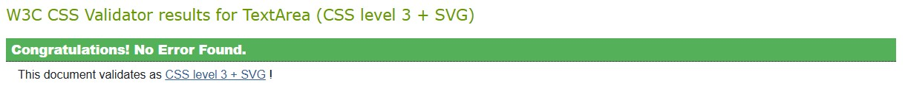

# Active Fitness
Active Fitness is a website designed for members and potential members who are passionate about health and wellness. Our website provides information about memberships, classes, equipment and personal training.

The live page can be viewed here: [Link to Active Fitness](https://paulmarren.github.io/User-Centric/index.html "Link to the live website")

# Table of Contents
- [Active Fitness](#active-fitness)
- [Table of Contents](#table-of-contents)
  - [UX](#ux)
    - [Features](#features)
    - [User stories](#user-stories)
      - [First Time Visitor Goals](#first-time-visitor-goals)
      - [Returning Visitor Goals](#returning-visitor-goals)
    - [Design](#design)
      - [Colour Scheme](#colour-scheme)
      - [Typography](#typography)
    - [Wireframes](#wireframes)
      - [Home Page](#home-page)
      - [Our Gyms Page](#our-gyms-page)
      - [Contact Us Page](#contact-us-page)
  - [Technologies used](#technologies-used)
    - [Languages used](#languages-used)
    - [Frameworks, Libraries \& Programs Used](#frameworks-libraries--programs-used)
  - [Testing](#testing)
    - [Validator Testing](#validator-testing)
    - [Lighthouse Testing](#lighthouse-testing)
    - [Testing User Stories from User Experience (UX) Section](#testing-user-stories-from-user-experience-ux-section)
  - [Deployment](#deployment)
    - [GitHub Pages](#github-pages)
  - [Credits](#credits)
    - [Polotno Studio](#polotno-studio)
    - [Fontawesome](#fontawesome)
    - [Techsini](#techsini)
    - [HTML validator](#html-validator)
    - [CSS validator](#css-validator)
    - [Image Resizer](#image-resizer)
    - [Pixabay](#pixabay)

## UX

### Features
- Responsive on all device sizes
- Interactive elements

### User stories
#### First Time Visitor Goals

   1. As a First Time Visitor, I want to understand the gym's facilities, equipment, and services to determine if it suits my fitness goals.
   2. As a First Time Visitor, I want to learn about membership options and pricing to decide if it fits my budget.
   3. As a First Time Visitor, I want to see testimonials or success stories to build trust in the gym's credibility.
   4. As a First Time Visitor, I want to find the gym's location and hours of operation to see if it's convenient for me.

#### Returning Visitor Goals

   1. As a Returning Visitor, I want to check the class schedule to plan my workouts.
   2. As a Returning Visitor, I want to find out about special promotions or discounts for existing members.
   3. As a Returning Visitor, I want to check for new classes, added facilities or equipment.

### Design
#### Colour Scheme
   -   The main colours used are white, gray and transparent black.
#### Typography
   -   The Oswald font is the main font used throughout the whole website with Sans Serif as the fallback font in case for any reason the font isn't being imported into the site correctly. 

### Wireframes
#### Home Page 
* [View Desktop Wireframe](assets/images/readme-images/desktop-home-page.png)
* [View Mobile Wireframe](assets/images/readme-images/mobile-homepage.png)
#### Our Gyms Page
* [View Desktop Wireframe](assets/images/readme-images/desktop-our-gyms-page.png)
* [View Mobile Wireframe](assets/images/readme-images/mobile-our-gyms-page.png)
#### Contact Us Page 
* [View Desktop Wireframe](assets/images/readme-images/desktop-contact-page.png)
* [View Mobile Wireframe](assets/images/readme-images/mobile-contact-page.png)

## Technologies used
### Languages used
  - HTML5
  - CSS3
  - JavaScript
### Frameworks, Libraries & Programs Used
   1. Bootstrap 5.3.3
      - Bootstrap was used to assist with the responsiveness and styling of the website.
   2. Google Fonts
      - Google fonts were used to import the 'Oswald' font into the style.css file which is used on all pages throughout the project.
   3. Font Awesome
      - Font Awesome was used on all pages throughout the website to add icons for aesthetic and UX purposes.
   4. Git
      - Git was used for version control by utilizing the Gitpod terminal to commit to Git and Push to GitHub.
   5. GitHub
      - GitHub is used to store the projects code after being pushed from Git and to deploy the website.
   6. Polotno Studio
      - Polotno Studio was used to design the logos and favicons.
   7. Balsamiq
      - Balsamiq was used to create the wireframes during the design process.
  
  
  
## Testing
### Validator Testing
The W3C Markup Validator and W3C CSS Validator Services were used to validate every page of the project to ensure there were no syntax errors in the project.
  - W3C Markup Validator 
      - All pages were checked for their HTML structure by the W3C Markup Validation Service. No document showed any errors.
         
  - W3C CSS Validator
      - The stylesheet file was checked via the W3C CSS Validation Service. No errors were found.
         

### Lighthouse Testing         
Lighthouse testing was used to determine the site's performance, accessibility, best practices and SEO. Special emphasis was layed on performance and accessibility to provide a great user experience for every visitor, no matter the device or conditions.

**Homepage**
   -   
   -   

**Our Gyms Page**
   -   
   -   

**Contact Page**
   -   
   -   

### Testing User Stories from User Experience (UX) Section
 -  #### First Time Visitor Goals
    1. As a First Time Visitor, I want to understand the gym's equipment, classes and personal trainers to determine if it suits my fitness goals.
         1. The user can view the different types of equipment via the Our Gyms page.
         2. The user can view the current available classes via the classes timetable on the Our Gyms page.
         3. The user can view our personal trainers along with their experience via the carousel on the Home page.
    2. As a First Time Visitor, I want to learn about membership options and pricing to decide if it fits my budget.
          1. The user can view the membership options and prices on the Our Gyms page.
    3. As a First Time Visitor, I want to see testimonials or success stories to build trust in the gym's credibility.
          1. The user can view testimonials submitted by our members on the Home page.
    4. As a First Time Visitor, I want to find the gym's location and hours of operation to see if it's convenient for me.
          1. The user can view the gyms location and hours of operation at the footer of any page. 

- #### Returning Visitor Goals
   1. As a Returning Visitor, I want to check the class schedule to plan my workouts.
      1. The user can view the classes timetable via the Our Gyms page.
   2. As a Returning Visitor, I want to find out about special promotions or discounts for existing members.
      1. The user can sign-up for special offers by completing the form on the Home page.
   3. As a Returning Visitor, I want to check for new classes, added facilities or equipment.
      1. The user can view the classes, facilities and equipment via the Our Gyms page.
  

## Deployment
### GitHub Pages
The project was deployed to GitHub Pages using the following steps...

1. **Log in to GitHub and locate the GitHub Repository.**  
   

2. **At the top of the Repository, locate the "Settings" Button on the menu.**  
   

3. **Scroll down the Settings page until you locate the "GitHub Pages" Section.**  
   

4. **Under "Source", click the dropdown called "None" and select "main".**  
   

5. **Scroll back down through the page to locate the now published site link in the "GitHub Pages" section.**  
   

## Credits
### [Polotno Studio](https://studio.polotno.com/)
* Used to create logo, footer and favicon images.
  
### [Fontawesome](https://fontawesome.com/)
* Used to implement website icons.

### [Techsini](https://techsini.com/multi-mockup/index.php)
* Used to create the mockup in the readme file.

### [HTML validator](https://validator.w3.org/)
* Used to verify HTML code.

### [CSS validator](https://jigsaw.w3.org/css-validator/)
* Used to verify CSS code.

### [Image Resizer](https://imageresizer.com/)
* Used to resize images.

### [Pixabay](https://pixabay.com/)
* [Personal Trainer Paul photo](https://pixabay.com/photos/olympic-rings-rings-workout-2141125/)
* [Personal Trainer John photo](https://pixabay.com/photos/in-person-trainer-fitness-coach-728226/)
* [Personal Trainer Luke photo](https://pixabay.com/photos/man-face-portrait-old-senior-1517990/)
* [Row of dumbells photo](https://pixabay.com/photos/fitness-dumbbells-training-gym-594143/)
* [Man performing rope curls photo](https://pixabay.com/photos/man-indian-fit-fitness-gym-1868632/)
* [Woman performing Yoga photo](https://pixabay.com/photos/woman-gymnastics-yoga-workout-1284656/)
* [Man performing dumbell rows photo](https://pixabay.com/photos/man-exercise-fitness-gym-dumbbells-2604149/)
* [Weight equipment photo](https://pixabay.com/photos/gym-equipment-weights-machines-91849/)
* [Cardio equipment photo](https://pixabay.com/photos/treadmill-workout-fitness-gym-5030966/)
* [Functional equipment photo](https://pixabay.com/photos/workout-ball-pilates-fitness-gym-1931107/)
* [Underground parking lot photo](https://pixabay.com/photos/parking-lot-underground-parking-car-4061323/)
* [Woman performing squats photo](https://pixabay.com/photos/gym-lift-training-bodybuilding-3516208/)
* [Woman performing leg press photo](https://pixabay.com/photos/woman-fitness-gym-health-senior-6777444/)
* [Man and woman posing photo](https://pixabay.com/photos/exercise-gym-sport-force-health-7291775/)
* [Open 24 hours photo](https://pixabay.com/photos/open-sign-neon-lights-illuminated-1836961/)
* [Piggy bank photo](https://pixabay.com/illustrations/piggy-bank-money-finance-banking-2889042/)
* [Yoga class photo](https://pixabay.com/photos/yoga-yoga-class-fitness-exercise-1994667/)